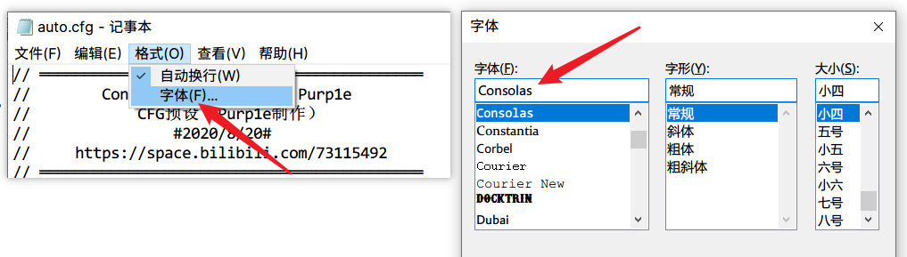

# {{ $frontmatter.title }}

> 适用于CS2几乎所有场景的CFG预设文件 - @[Purple紫](https://space.bilibili.com/73115492) 制作

- 项目始于2018年8月，这套预设涵盖了几乎所有应用的场景，注释详细
- 所有的参数都经过详细的测试，按键位置仔细斟酌，确保每个功能的按键都在它用起来最舒服的位置
- 适用于对CSGO指令不太熟悉，想要到手即用，节省时间的玩家，亦或是想要参考他人的代码来丰富自己CFG的玩家。
- 下载这套预设之后，根据使用说明，备份设置、简单修改参数、放在正确的位置、设置启动项后即可享受预设带来的便利，一般整个过程不超过30分钟。

### 下载

- [HLAE中文站](https://hlae.site)
- [加速下载](https://api.upup.cool/get/cs2-cfg)
- [GitHub下载](https://github.com/Purple-CSGO/CS2-Config-Presets/releases/latest)
- 帧数基准测试：https://purp1e.lanzouu.com/b01lzyyef 密码:1fn4
- CFG 预设 For CS2：https://purp1e.lanzouu.com/b01lzyyfg 密码:41wc
- CS2 Reshade 整合包：https://purp1e.lanzouu.com/b0ny8cdij 密码:9as4

### 传送门

[控制台指令](https://tools.dathost.net/csgo-commands) · [HLAE Studio](https://github.com/One-Studio/HLAE-Studio) · [CS工具箱](https://cstb.upup.cool/)

### 编辑器

请修改记事本字体为Consolas之类的等宽字体以获得更好体验

> 也可以前往[编辑器](/v1/editor.html)页面配置VSCode

